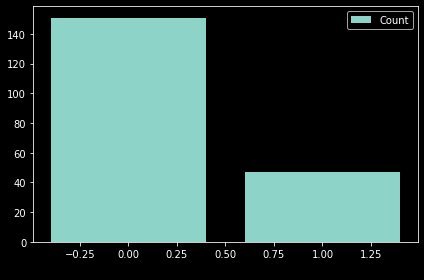

# Breast-Cancer-Prediction-Classifier
<h3>Breast cancer is cancer that develops in breast cells. Typically, the cancer forms in either the lobules or the ducts of the breast. Lobules are the glands that produce milk, and ducts are the pathways that bring the milk from the glands to the nipple. Cancer can also occur in the fatty tissue or the fibrous connective tissue within your breast.</h3>

<h4>This dataset contains 3 measures (mean, standard deviation, and worst) for 10 different cell features -
radius, texture, perimeter, area, smoothness, compactness, concavity, concave points, symmetry, and
fractal dimension. All these features have been computed from a digitized image of a fine needle
aspirate of a breast mass, and they describe characteristics of the cell nuclei present in the image.</h4>
